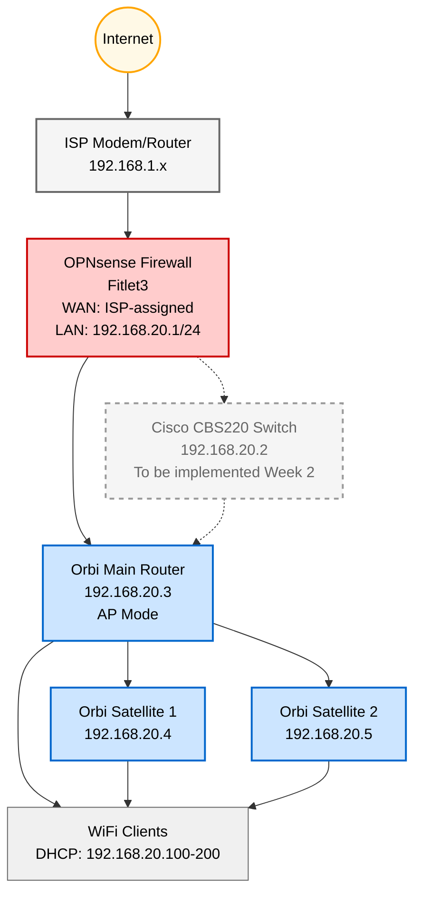

# Laying the Foundation - Home Lab - Week 1

**Date:** 2025-11-10
**Week:** 1 of 16

---
## Introduction

When I completed the OPNsense setup wizard and successfully pinged 8.8.8.8 through my own router, I couldn't believe how straightforward it was. Years of assuming router configuration required advanced networking skills gone in 15 minutes.

As a SCADA developer building my backend and DevOps skills, I need hands-on experience, not just theory. This 16-week homelab project builds that expertise while leveraging my OT/IT networking knowledge.

## Background & Context

This is week 1 of a 16-week journey documenting my home lab building process. I'm documenting everything so you can follow along and so that I can demonstrate my skills.

This week I laid the foundation of the home lab by configuring [OPNsense](https://opnsense.org/download/) on a [Fitlet3](https://fit-iot.com/web/products/fitlet3/) and setting up WiFi coverage using a [Netgear Orbi RBK13 Mesh WiFi system](https://www.netgear.com/ca-en/home/wifi/mesh/rbk13/). One of my core goals is building deeper networking knowledge, and setting up this foundation accomplishes that.

**This week's goals:**
- Configure OPNsense router on Fitlet3
- Configure Orbi WiFi mesh network in Access Point mode
- Identify network improvements for future weeks

> This post covers two key network components: OPNsense router configuration (WAN, LAN, firewall rules) and Orbi WiFi setup in Access Point mode, followed by performance testing and identified improvements.

## Network Topology

Here's the network architecture we're building this week:

*Red: Routing/Firewall layer*
*Blue: WiFi/Access Point layer*
*Yellow: Internet*
*Gray: Future components*

---

## OPNsense Router Configuration is Simpler Than You Think

Most people assume configuring a firewall/router requires CCNA-level networking knowledge. I assumed the same thing. But OPNsense's setup wizard walks you through the essentials: WAN (Wide Area Network - your internet connection), LAN (Local Area Network - your home network), DNS (Domain Name System - translates website names to IP addresses), and basic firewall rules.

The entire process took 15 minutes.

### Step 1: Configure OPNsense WAN Interface

**Note:** I set up OPNsense while my ISP's WiFi router was still running. To avoid IP conflicts, I changed OPNsense's LAN IP from the default `192.168.1.1/24` to `192.168.20.1/24` via console before accessing the web UI.

#### 1.1 Access OPNsense Web UI

1. Connect laptop to Fitlet3 LAN port via Ethernet (or to default LAN network)
2. Open browser and navigate to: `https://192.168.20.1` (or `https://192.168.1.1` if using default)
3. Login:
   - **Username:** `root`
   - **Password:** (set during installation)

#### 1.2 Run Initial Setup Wizard

1. **System > Wizard > Setup Wizard**
2. **General Information:**
   - Hostname: `opnsense`
   - Domain: `homelab.internal`
   - Primary DNS: `8.8.8.8` (Google DNS)
   - Secondary DNS: `8.8.4.4`
3. **Time Server:** `pool.ntp.org`
4. **RFC1918 Networks:** Uncheck "Block RFC1918 Private Networks" (allows local network communication)

#### 1.3 Configure WAN Interface

1. **Interfaces > WAN**
2. **General Configuration:**
   - **Enable:** ✓ Checked
   - **IPv4 Configuration Type:** DHCP (Dynamic Host Configuration Protocol - automatic IP from ISP)
   - **IPv6 Configuration Type:** None (unless your ISP provides IPv6)
3. **DHCP Configuration:**
   - **DHCP Hostname:** `opnsense-homelab`
4. **Save** and **Apply Changes**

#### 1.4 Verify WAN Connectivity

1. **Interfaces > Overview**
2. Verify WAN interface shows:
   - **Status:** `up`
   - **IPv4 Address:** (assigned by ISP)
   - **Gateway:** (ISP gateway)
3. **Diagnostics > Ping**
   - Ping `8.8.8.8` to verify internet connectivity
   - Should see replies with <50ms latency

**Troubleshooting:**
- If no IP address: Check physical cable connection to ISP modem
- If no internet: Verify ISP modem is online and not in bridge mode
- If gateway missing: Try rebooting ISP modem

*OPNsense dashboard showing active WAN connection with ISP-assigned IP and internet connectivity*

---

### Step 2: Configure LAN Interface

#### 2.1 Set LAN Network

1. **Interfaces > LAN**
2. **General Configuration:**
   - **Enable:** ✓ Checked
   - **IPv4 Configuration Type:** Static IPv4
   - **IPv4 Address:** `192.168.20.1/24`
     - (This will be the IT VLAN gateway in Week 2)
3. **Save** and **Apply Changes**

**Note:** After applying, OPNsense web UI will move to `https://192.168.20.1`

#### 2.2 Enable DHCP Server

1. **Services > DHCPv4 > [LAN]**
2. **Enable DHCP server on LAN interface:** ✓ Checked
3. **Range:**
   - **From:** `192.168.20.100`
   - **To:** `192.168.20.200`
4. **Save** and **Apply**

---

### Step 3: Configure Basic Firewall Rules

#### 3.1 Default LAN Rules (allow all outbound)

1. **Firewall > Rules > LAN**
2. Verify default rule exists:
   - **Action:** Pass
   - **Interface:** LAN
   - **Source:** LAN net
   - **Destination:** any
   - **Description:** "Default allow LAN to any"

**This rule allows all traffic from LAN to internet (temporary, will restrict in Week 2 with VLANs)**

#### 3.2 WAN Rules (block all inbound)

1. **Firewall > Rules > WAN**
2. Verify no WAN rules are defined by default
   - The interface should show: **"No WAN rules are currently defined. All incoming connections on this interface will be blocked until you add a pass rule."**

**This is OPNsense's secure default (no rules means all incoming traffic from the internet is blocked)**

---

That's it. From wizard to production-ready router in 15 minutes. The setup wizard handles DNS, DHCP, and secure firewall defaults (no specialized networking knowledge required). WAN blocks all inbound traffic, LAN allows outbound, and the router is ready for VLAN expansion in Week 2 (impossible with ISP routers).

I know what you're thinking: *"Why bother? My ISP router works fine."*

That's what I thought too. But ISP routers have critical limitations:
- **No VLAN support:** Can't segment OT (industrial) from IT (personal) networks
- **Limited firewall rules:** Can't create custom inter-VLAN rules
- **Infrequent firmware updates:** Security patches can lag months behind
- **No future expansion:** Can't add VPN, IDS/IPS, or custom services

The basic OPNsense config is just the starting point. It's easy to get running, then you expand with features as you need them.

With routing and firewall secured, I needed WiFi coverage throughout the house. That's where the Orbi mesh system comes in, but configured as an Access Point, not a router.

---

## WiFi Access Point Mode: Separating Routing from Radio

The Orbi can function as either a router (handles DHCP, routing, NAT) or an Access Point (AP - just handles WiFi). Since OPNsense is already handling routing and DHCP, running Orbi in AP mode prevents double-NAT issues and keeps the network architecture clean.

This separation of concerns is crucial: **OPNsense = routing/firewall, Orbi = WiFi coverage only.**

### Step 1: Configure Orbi in Access Point Mode

#### 1.1 Connect to Orbi

1. Connect laptop to Orbi WiFi network (default SSID on label)
2. Open browser and navigate to: `http://orbilogin.com` or `http://192.168.1.1`
3. Login with default credentials (on router label)

#### 1.2 Switch to AP Mode

1. **Advanced > Advanced Setup > Router / AP Mode**
2. Select **AP Mode**
3. **Apply**
4. Wait for Orbi to reboot (~2 minutes)

**What this does:** Disables Orbi's routing and DHCP functions. It now only broadcasts WiFi.

*Orbi configuration page showing Router/AP Mode selection - switching from Router mode to Access Point mode*

#### 1.3 Reconfigure Orbi Network Settings

After reboot, Orbi will be on OPNsense's LAN network (192.168.20.x):

1. Find Orbi's new IP: **OPNsense > Services > DHCPv4 > Leases**
2. Connect to Orbi via new DHCP IP
3. **Settings > Network:**
   - **Router IP:** `192.168.20.3` (static, reserved in OPNsense DHCP)
   - **Subnet Mask:** `255.255.255.0`
   - **Gateway:** `192.168.20.1` (OPNsense)
4. **WiFi Settings:**
   - **SSID:** `Example-SSID` (temporary, will split to VLANs in Week 2)
   - **Security:** WPA2-PSK or WPA3
   - **Password:** (strong password)
5. **Save Settings**

#### 1.4 Position Satellites for Mesh Coverage

1. Place Orbi satellites ~30-50 feet from main router
2. Power on satellites
3. Wait for blue LED (successful sync with main router)
4. Verify coverage in different areas of home
5. Reserve Static IPs in OPNsense:
   - **Satellite 1:** `192.168.20.4`
   - **Satellite 2:** `192.168.20.5`

---

### Step 2: Performance Testing

#### 2.1 Speed Test at Router

1. **Orbi Web UI > Internet Speed Test**
2. Verify internet speed to router: ~900 Mbps ✓

*Orbi web UI showing internet speed test results - ~900 Mbps connection to router confirmed*

#### 2.2 Speed Test at Client Devices

1. Walk through house with smartphone
2. Test WiFi speed at key locations (bedroom, office, living room)
3. **Google Speed Test** on phone

**Results:** Max WiFi speed achieved: ~150 Mbps

**Discovery:** Orbi RBK13 is WiFi 5, not WiFi 6. The hardware bottleneck limits clients to 150 Mbps even though the internet connection is 900 Mbps.

---

The result? Full house coverage with 3 mesh nodes, no double-NAT issues, and static IPs for easier management. Internet to router clocked in at ~900 Mbps. Perfect.

Then I tested WiFi speeds on my phone. The max speed? 150 Mbps.

I thought it was a configuration error. After testing a few locations throughout the house (eg. bedroom, office, living room) I realized my gigabit internet was bottlenecked by 5-year-old WiFi 5 hardware. The Orbi RBK13 simply can't push more than 150 Mbps to clients.

You might be wondering: *"Why use Orbi if you're building a professional homelab? Why not start with WiFi 6 from the beginning?"*

Fair question. I already owned the Orbi RBK13 from my previous home where we had 150 Mbps internet. It worked perfectly there. I was unaware of its limitation until I set it up at the new home with 1 Gbps internet.

But this is actually a valuable lesson: baseline testing reveals bottlenecks you didn't know existed. Working incrementally (use what you have, then upgrade) teaches you more than buying everything new upfront.

---

## Summary & Lessons Learned

Week 1 is complete. I configured OPNsense (WAN, LAN, DHCP, firewall rules) in 15 minutes, set up Orbi mesh WiFi in Access Point mode for whole-home coverage, and established a performance baseline that revealed a critical bottleneck: WiFi 5 limiting speeds to 150 Mbps despite 900 Mbps internet.

Setting up OPNsense is easier than you think. If you've been intimidated by DIY routers, the setup wizard makes it approachable. From this basic foundation, you can expand with VLANs, VPN, IDS/IPS, and custom firewall rules, features impossible with ISP-provided routers.

**Three areas for improvement identified:**

1. **Upgrade WiFi:** Replace Orbi (WiFi 5, ~150 Mbps) with WiFi 6 access point (Grandstream GWN7660E, ~900 Mbps)
2. **VLAN Segmentation (Week 2):** Separate OT (industrial devices) from IT (personal devices) networks
3. **Advanced Firewall Rules:** Implement inter-VLAN rules, restrict outbound traffic, add monitoring

Don't rely on your ISP's outdated router firmware. OPNsense gives you control, security, and expandability. Start with the basics (like I did this week), then iterate and improve.

Next week: VLAN segmentation with a Cisco CBS220 switch. Follow along!

---

## Next Week Preview

**Week 2: What the Heck are VLANs?**

Next week I'm tackling VLAN (Virtual LAN) segmentation to separate OT and IT networks:

1. **Cisco CBS220 Switch:** VLAN configuration (OT=VLAN 10, IT=VLAN 20, Management=VLAN 99)
2. **OPNsense VLAN Interfaces:** Creating virtual interfaces for each VLAN
3. **Inter-VLAN Firewall Rules:** Restricting traffic between OT and IT networks

VLANs are new territory for me, so expect some troubleshooting along the way. Follow along!

---

## Resources & Links

**OPNsense Documentation:**
- [OPNsense Getting Started](https://docs.opnsense.org/manual/how-tos/installguide.html)
- [OPNsense Interface Configuration](https://docs.opnsense.org/manual/interfaces.html)

**Orbi Documentation:**
- [Orbi Setup Guide](https://kb.netgear.com/25072/Setting-up-your-Orbi-WiFi-System-in-Access-Point-AP-Mode)

**Related Homelab Docs:**
- [Hardware: Fitlet3](../hardware/fitlet3-opnsense.md)
- [Hardware: Network Topology](../hardware/network-topology.md)

**Writing Framework:**
- [The Algorithmic Framework for Writing Good Technical Articles](https://www.theocharis.dev/blog/algorithmic-framework-for-writing-technical-articles/)
