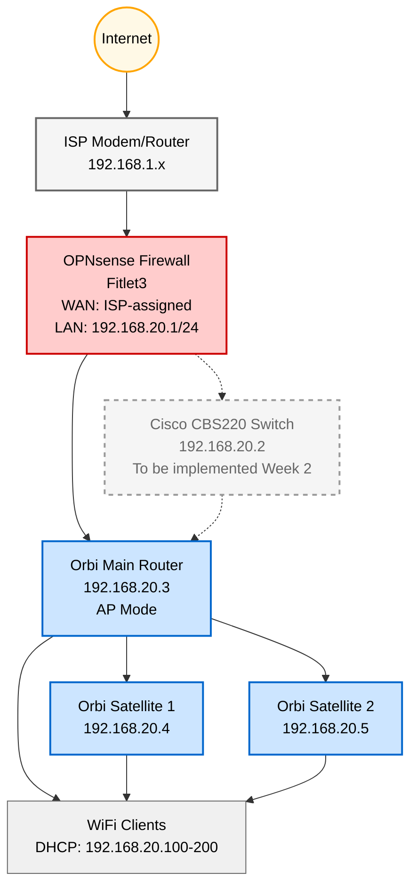

# Laying the Foundation - Homelab
**See the [Homelab GitHub Repo](https://github.com/aott33/iiot-kubernetes-homelab)**

**Week:** 1 of 16

---
## Introduction

As a SCADA developer building my backend and DevOps skills, I need hands-on experience, not just theory. This 16-week homelab project builds that expertise while leveraging my OT/IT networking knowledge.

## Background & Context

This is week 1 of a 16-week journey documenting my Homelab building process. I'm documenting everything so you can follow along and so that I can demonstrate my skills.

This week I laid the foundation of the Homelab by configuring [OPNsense](https://opnsense.org/download/) on a [Fitlet3](https://fit-iot.com/web/products/fitlet3/) and setting up WiFi coverage using a [Netgear Orbi RBK13 Mesh WiFi system](https://www.netgear.com/ca-en/home/wifi/mesh/rbk13/). One of my core goals is building deeper networking knowledge, and setting up this foundation accomplishes that.

> This post covers two key network components: OPNsense router configuration (WAN, LAN, firewall rules) and Orbi WiFi setup in Access Point mode, followed by performance testing and identified improvements.

## Network Topology

Here's the network architecture we're building this week:

*Red: Routing/Firewall layer*  
*Blue: WiFi/Access Point layer*  
*Yellow: Internet*  
*Gray: Future components*  

---

## OPNsense Router Configuration is Simpler Than You Think

Not sure if you are in the same boat but I assumed configuring a firewall/router required expert level networking knowledge. But OPNsense's setup wizard walks you through the essentials: WAN (Wide Area Network - your internet connection), LAN (Local Area Network - your home network), DNS (Domain Name System - translates website names to IP addresses), and basic firewall rules.

The entire process took 15 minutes.

### Quick Setup Summary

**Note:** I set up OPNsense while my ISP's router was still running. To avoid IP conflicts, I changed OPNsense's LAN IP from `192.168.1.1/24` to `192.168.20.1/24` via console first.

**The 5-step configuration:**

1. **Access Web UI:** Connect laptop to Fitlet3 LAN port, navigate to `https://192.168.20.1`, login as `root`

2. **Run Setup Wizard:** Configure hostname (`opnsense`), domain (`homelab.internal`), DNS servers (`8.8.8.8`, `8.8.4.4`), and time server (`pool.ntp.org`)

3. **Configure WAN:** Set to DHCP (automatic IP from ISP), verify connectivity with ping test to `8.8.8.8`

4. **Configure LAN:** Set static IP `192.168.20.1/24`, enable DHCP server with range `192.168.20.100-200`

5. **Verify Firewall Defaults:** LAN allows all outbound traffic, WAN blocks all inbound (secure by default)

*OPNsense dashboard showing active WAN connection with ISP-assigned IP and internet connectivity*

---

That's it. From wizard to production-ready router in 15 minutes. The setup wizard handles DNS, DHCP, and secure firewall defaults (no specialized networking knowledge required). WAN blocks all inbound traffic, LAN allows outbound, and the router is ready for VLAN expansion in Week 2. 

Maybe you're thinking: *"Why bother? My ISP router works fine."*

That's what I thought too. But ISP routers have critical limitations:
- **No VLAN support:** Can't segment OT (industrial) from IT (personal) networks
- **Limited firewall rules:** Can't create custom inter-VLAN rules
- **Infrequent firmware updates:** Security patches can lag months behind
- **No future expansion:** Can't add VPN or custom services

The basic OPNsense configuration is just the starting point. It's easy to get running, then you expand with features as you need them.

With routing and firewall secured, I needed WiFi coverage throughout the house. That's where the Orbi mesh system comes in, but configured as an Access Point, not a router.

---

## WiFi Access Point Mode

The Orbi can function as either a router (handles DHCP, routing, NAT) or an Access Point (AP - just handles WiFi). Since OPNsense is already handling routing and DHCP, running Orbi in AP mode prevents double-NAT issues and keeps the network architecture clean.

This separation of concerns is crucial: **OPNsense = routing/firewall, Orbi = WiFi coverage only.**

### Quick Setup Summary

**The 4-step configuration:**

1. **Switch to AP Mode:** Connect to Orbi (`http://orbilogin.com`), navigate to **Advanced > Router/AP Mode**, select **AP Mode**, reboot (~2 minutes)

2. **Reconfigure Network Settings:** After reboot, find Orbi's new IP in OPNsense DHCP leases, set static IP `192.168.20.3`, gateway `192.168.20.1`, configure WiFi SSID and password

3. **Position Satellites:** Place satellites 30-50 feet from main router, verify blue LED sync, reserve static IPs (`192.168.20.4`, `192.168.20.5`)

4. **Performance Testing:** Run speed test in Orbi web UI (~900 Mbps to router ✓), test WiFi speeds on phone at multiple locations (max ~150 Mbps ✗)

*Orbi configuration showing Router/AP Mode switch*

*Speed test showing ~900 Mbps to router, but WiFi clients limited to ~150 Mbps due to WiFi 5 hardware*

---

The result? Full house coverage with 3 mesh nodes, no double-NAT issues, and static IPs for easier management. Internet to router clocked in at ~900 Mbps.

Then I tested WiFi speeds on my phone. The max speed? 150 Mbps.

I thought it was a configuration error. After testing a few locations throughout the house (eg. bedroom, office, living room) I realized my gigabit internet was bottlenecked by 5-year-old WiFi 5 hardware. The Orbi RBK13 can't push more than 150 Mbps to clients.

You might be wondering: *"Why use Orbi if you're building a professional homelab? Why not start with WiFi 6 from the beginning?"*

Good question. I already owned the Orbi RBK13 from my previous home where we had 150 Mbps internet. It worked perfectly there. I was unaware of its limitation until I set it up at the new home with 1 Gbps internet.

But this is a valuable lesson: baseline testing reveals bottlenecks you didn't know existed. Working incrementally (use what you have, then upgrade) teaches you more than buying everything new upfront.

---

## Summary & Lessons Learned

Week 1 is complete. I configured OPNsense (WAN, LAN, DHCP, firewall rules) in 15 minutes, set up Orbi mesh WiFi in Access Point mode for whole-home coverage, and established a performance baseline that revealed a critical bottleneck: WiFi 5 limiting speeds to 150 Mbps despite 900 Mbps internet.

Setting up OPNsense is easier than you think. If you've been intimidated by DIY routers, the setup wizard makes it approachable. From this basic foundation, you can expand with VLANs, VPN, IDS/IPS, and custom firewall rules, features impossible with ISP-provided routers.

**Three areas for improvement identified:**

1. **Upgrade WiFi:** Replace Orbi (WiFi 5, ~150 Mbps) with WiFi 6 access point (Grandstream GWN7660E, ~900 Mbps)
2. **VLAN Segmentation (Week 2):** Separate OT (industrial devices) from IT (personal devices) networks
3. **Advanced Firewall Rules:** Implement inter-VLAN rules, restrict outbound traffic, add monitoring

Don't rely on your ISP's outdated router firmware. OPNsense gives you control, security, and expandability. Start with the basics (like I did this week), then iterate and improve.

Next week: VLAN segmentation with a Cisco CBS220 switch. Follow along!

---

## Next Week Preview

**Week 2: What the Heck are VLANs?**

This coming week I'm tackling VLAN (Virtual LAN) segmentation to separate OT and IT networks:

1. **Cisco CBS220 Switch:** VLAN configuration (OT=VLAN 10, IT=VLAN 20, Management=VLAN 99)
2. **OPNsense VLAN Interfaces:** Creating virtual interfaces for each VLAN
3. **Inter-VLAN Firewall Rules:** Restricting traffic between OT and IT networks

VLANs are new territory for me, so expect some troubleshooting along the way. Follow along!

---

## Resources & Links

**OPNsense Documentation:**
- [OPNsense Getting Started](https://docs.opnsense.org/manual/how-tos/installguide.html)
- [OPNsense Interface Configuration](https://docs.opnsense.org/manual/interfaces.html)

**Orbi Documentation:**
- [Orbi Setup Guide](https://kb.netgear.com/25072/Setting-up-your-Orbi-WiFi-System-in-Access-Point-AP-Mode)

**Writing Framework:**
- [The Algorithmic Framework for Writing Good Technical Articles](https://www.theocharis.dev/blog/algorithmic-framework-for-writing-technical-articles/)

---

| Previous Week | Next Week |
|---|---|
| - | [What the Heck are VLANs?](https://aott33.github.io/2025/11/17week-02-switch-config.html) |
