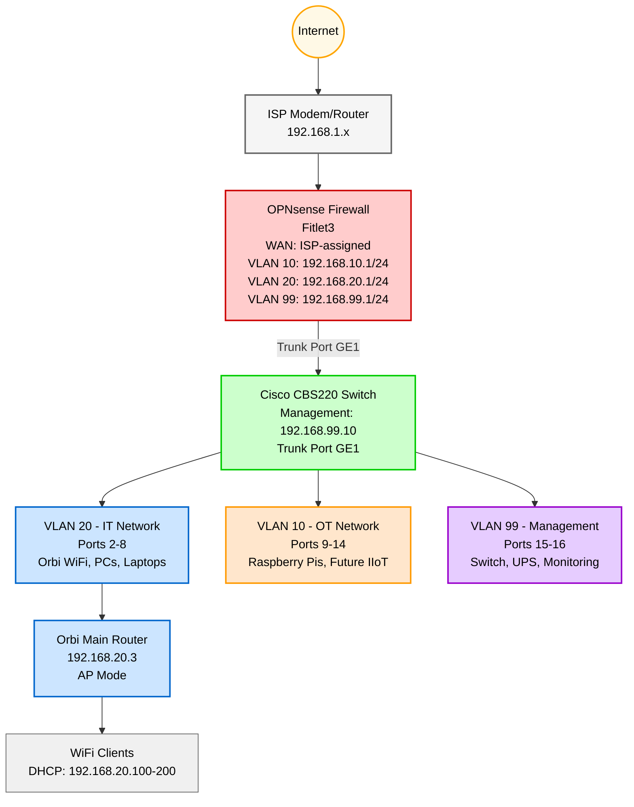

# What the heck are VLANs? - Homelab
## Network Segmentation for OT/IT Security

**See the [Homelab GitHub Repo](https://github.com/aott33/iiot-kubernetes-homelab)**

**Week:** 2 of 16

---

## Introduction

Most homelab guides treat all devices equally, laptops, servers, industrial sensors, all on the same network. That's a security nightmare for Industrial IoT applications.

As a SCADA developer building my backend and DevOps skills, I need hands-on experience with production-grade network architecture, not just theory. This week I learned what VLANs actually are and implemented the same network segmentation approach used in manufacturing plants to protect industrial systems from ransomware and unauthorized access.

## Background & Context

This is week 2 of a 16-week journey documenting my Homelab building process. Week 1 established the foundation with OPNsense routing and WiFi coverage. This week builds on that foundation by adding security through network segmentation.

Before starting this week I had a high-level understanding of VLANs. Now I can confidently say I know what they are, how they work, and how to configure them. It was quite a journey with a few hurdles that I needed to jump over.

**This week's goals:**
1. Configure Cisco CBS220 switch with 3 VLANs (OT=VLAN 10, IT=VLAN 20, Management=VLAN 99)
2. Create VLAN interfaces in OPNsense for routing between networks
3. Implement firewall rules to enforce OT/IT isolation

> This post covers VLAN fundamentals, switch and firewall configuration, isolation testing, and lessons learned from configuring infrastructure out of order.

## Network Topology

Here's the network architecture after this week's implementation:



*Red: Routing/Firewall* <br>
*Green: Switch/VLANs* <br>
*Blue: IT Network (VLAN 20)* <br>
*Orange: OT Network (VLAN 10)* <br>
*Purple: Management (VLAN 99)* <br>


*Server rack with Cisco CBS220 switch, OPNsense Fitlet3, and Orbi WiFi mesh system mounted and ready for VLAN configuration*

---

## Understanding VLANs: The Elevator Analogy

When the Cisco CBS220 switch arrived, I was eager to get it working. I powered it up, connected it to my network, and started using it as a basic unmanaged switch. Everything worked fine on the flat `192.168.20.0/24` network.

Then I realized: I'd created extra work for myself.

Now I needed to configure VLANs on both OPNsense and the switch, move the switch from `192.168.20.2` to `192.168.99.10` (Management VLAN), update DHCP reservations, and potentially lose access requiring ethernet reconnection. If I had planned first and configured VLANs in OPNsense before connecting the switch, it would have gone straight to the Management VLAN with no migration needed.

**Lesson learned:** Infrastructure should be designed, not improvised.

But this "side quest" taught me valuable lessons. I now understand flat networks vs. VLANs, not just from theory but from experiencing both states. I saw how devices migrate between subnets, troubleshot VLAN connectivity, and truly appreciate the power of planning.

### The Elevator Analogy

Here's the analogy that finally made VLANs click for me:

**A flat network** (no VLANs) is like a building with one elevator. Everyone takes the same elevator floor to floor. Sometimes you wait. Sometimes important people carrying critical data share the elevator with potentially risky people. Everyone sees everyone else's traffic.

**A VLAN-segmented network** is like a building with multiple elevators where people need badges to access specific elevators. Everyone knows the elevators exist, but each elevator serves specific people. Only those who need to be on that elevator can access it.

The switch enforces this separation at Layer 2 (like badge readers at elevators), while OPNsense acts as security between elevators (Layer 3 firewall), deciding who can visit which floors.

### Why VLANs Matter for IIoT Homelabs

I'm simulating an industrial enterprise with both an IT department (laptops, servers, cloud services) and an Automation/OT department (PLCs, sensors, SCADA systems). In real manufacturing environments, these networks are air-gapped for security.

**Without VLANs:**
- Malware on my laptop could scan and infect Raspberry Pis running industrial protocols
- Broadcast traffic from WiFi clients floods industrial devices
- No way to enforce different firewall policies per device type
- Single point of compromise gives attacker access to everything

**With VLANs:**
- IT VLAN (20): Full internet, can access management, blocked from OT
- OT VLAN (10): Limited internet (updates only), blocked from IT, can send data to IT platforms via specific ports
- Management VLAN (99): No internet access, accessible only from IT VLAN, isolated from OT

This follows ISA/IEC 62443 industrial security standards: defense in depth through network segmentation.

---

## Implementing VLANs: Configuration Overview

The configuration process had three main stages:

### 1. OPNsense VLAN Configuration (30 minutes)

First, I created VLAN interfaces in OPNsense before touching the switch. This ensures OPNsense is ready to route VLAN traffic when the switch starts sending tagged frames.

**Steps:**
1. Created three VLAN interfaces on the LAN parent interface (VLAN 10, 20, 99)
2. Assigned each VLAN to a dedicated interface (VLAN10_OT, VLAN20_IT, VLAN99_MGT)
3. Configured static IPs for each VLAN gateway:
   - VLAN 10 (OT): `192.168.10.1/24`
   - VLAN 20 (IT): `192.168.20.1/24`
   - VLAN 99 (Management): `192.168.99.1/24`
4. Enabled DHCP servers for each VLAN with appropriate IP ranges


*OPNsense showing all three VLANs created on the LAN interface*

**Critical concept:** OPNsense now has multiple IP addresses, one per VLAN. Devices on VLAN 10 use gateway `192.168.10.1`, devices on VLAN 20 use `192.168.20.1`, and management devices use `192.168.99.1`. The switch's VLAN tags tell OPNsense which interface to route traffic through.

### 2. Cisco Switch VLAN Configuration (20 minutes)

Next, I configured the switch to segment ports into VLANs and create a trunk port to carry all VLANs to OPNsense.

**Steps:**
1. Created VLAN database (VLAN 10, 20, 99)
2. **Configured trunk port FIRST** (Port GE1 to OPNsense) allows all VLANs to pass
3. Assigned access ports to VLANs:
   - Ports 2-8: VLAN 20 (IT) Orbi WiFi, PCs, laptops
   - Ports 9-14: VLAN 10 (OT) Raspberry Pis, future IIoT devices
   - Ports 15-16: VLAN 99 (Management) Switch management, UPS
4. Moved switch management IP from `192.168.20.2` to `192.168.99.10`


*Cisco CBS220 switch VLAN table showing all configured VLANs*

**Important:** Configuring the trunk port before assigning access ports prevents connectivity loss. The trunk carries VLAN-tagged traffic to OPNsense, which routes between VLANs based on firewall rules.

### 3. Firewall Rules for OT/IT Segmentation (30 minutes)

Finally, I implemented firewall rules to enforce security isolation between VLANs.

**OT VLAN (VLAN 10) Rules:**
1. Allow MQTT (port 1883, 8883) to IT VLAN for future EdgeX → UMH data flow
2. Allow Kafka (port 9092) to IT VLAN for future data pipelines
3. **Block all other IT traffic** prevents OT from accessing laptops/servers
4. Allow outbound (internet) for updates


*OT VLAN firewall rules (specific ports allowed, general IT access blocked)*

**IT VLAN (VLAN 20) Rules:**
1. **Block IT → OT** most important rule for security
2. Allow IT → Management (so I can access switch/UPS from WiFi)
3. Allow IT → Internet (full internet access)


*IT VLAN firewall rules (OT blocked, management and internet allowed)*

**Management VLAN (VLAN 99) Rules:**
1. **Block internet access** (using `!RFC1918` alias) (security hardening)
2. Allow all local networks (can reach all VLANs for administration)


*Management VLAN blocks public IPs (!RFC1918) while allowing private networks*

**Critical lesson:** Firewall rules are processed top-to-bottom, **first match wins**. Specific rules (block IT → OT) must come before general rules (allow IT → internet), otherwise the general rule matches first and the block never triggers.

---

## Testing VLAN Isolation

After configuration, I ran a series of tests from my laptop (connected via WiFi on VLAN 20 IT Network) to verify the firewall rules were working correctly.

### Test 1: IT VLAN to Internet (Should Work)
```powershell
C:\Users\AndrewOtt>ping 8.8.8.8

Pinging 8.8.8.8 with 32 bytes of data:
Reply from 8.8.8.8: bytes=32 time=9ms TTL=118
Reply from 8.8.8.8: bytes=32 time=10ms TTL=118
```
**Result:** PASS - IT VLAN has full internet access

### Test 2: IT VLAN to Management VLAN (Should Work)
```powershell
C:\Users\AndrewOtt>ping 192.168.99.10

Reply from 192.168.99.10: bytes=32 time=3ms TTL=63
```
**Result:** PASS - IT can access switch on Management VLAN for administration

### Test 3: IT VLAN to OT VLAN (Should FAIL - Most Important!)
```powershell
C:\Users\AndrewOtt>ping 192.168.10.1

Pinging 192.168.10.1 with 32 bytes of data:
Request timed out.
Request timed out.
```
**Result:** PASS (Correctly Blocked!) - **OT network is isolated from IT**

This is the most critical test. Even though I am on the IT network with full internet access, I cannot reach the OT network. If malware infected my laptop, it could not spread to industrial devices.

### Advanced Tests: Management and OT VLANs

I also tested from Management VLAN (connected via ethernet to Port 15) and OT VLAN (Port 9):

**Management VLAN to Internet:** Blocked (RFC1918 rule working)
**Management VLAN to All local VLANs:** Allowed (can administer infrastructure)
**OT VLAN to IT VLAN:** Blocked (except MQTT/Kafka ports)
**OT VLAN to Internet:** Allowed (for updates can be blocked later for full air-gap)

All tests passed. VLANs are properly isolated with firewall enforcement working as designed.

---

## Summary & Lessons Learned

Week 2 is complete. I configured VLANs on both the Cisco CBS220 switch and OPNsense, implemented production-grade OT/IT network segmentation, and verified isolation through comprehensive testing. The network now has three broadcast domains with firewall-enforced security policies.

**What worked well:**
- **Trunk-first configuration:** Configuring the trunk port before assigning access ports prevented connectivity loss
- **OPNsense before switch:** Setting up VLAN interfaces in OPNsense first ensured routing was ready when switch started sending tagged traffic
- **Firewall rule order:** Understanding "first match wins" prevented security gaps from general rules matching before specific blocks
- **Systematic testing:** Testing from each VLAN revealed firewall behavior and confirmed isolation

**The biggest lesson: Plan before implementing**

When the switch arrived, I powered it up immediately and started using it as a basic unmanaged switch on the flat `192.168.20.0/24` network. This created extra work later. I had to configure VLANs on both devices, migrate the switch from `192.168.20.2` to `192.168.99.10`, update DHCP reservations, and risk losing access.

If I had planned first, it would have gone straight to the Management VLAN with no migration needed.

But this "side quest" taught valuable lessons. I experienced both flat and segmented networks (not just theory), saw how devices migrate between subnets, troubleshot VLAN connectivity, and deeply understand DHCP across VLANs. **Infrastructure should be designed, not improvised**, but sometimes learning the hard way builds stronger understanding.

**Three key takeaways:**

1. **VLANs provide defense in depth:** Even if my laptop is compromised, malware cannot reach OT devices due to firewall isolation
2. **Firewall rule order matters:** Specific rules (block IT → OT) must come before general rules (allow IT → internet)
3. **Management networks need hardening:** Blocking internet access on Management VLAN (using `!RFC1918` alias) prevents compromised infrastructure from phoning home

This is the same network segmentation approach used in manufacturing plants to comply with ISA/IEC 62443 industrial security standards. From this foundation, I can now add Kubernetes nodes, industrial protocols, and IIoT platforms with proper network isolation.

Next week: Kubernetes cluster setup begins with K3s control plane deployment.

---

## Next Week Preview

**Week 3: K3s Control Plane - Building the Kubernetes Foundation**

With network segmentation in place, I'm ready to deploy the first Kubernetes node. This week I'm tackling K3s control plane setup on my gaming PC:

1. Install Arch Linux on gaming PC (IT VLAN)
2. Deploy K3s server (control plane) with no workload scheduling
3. Verify control plane is accessible from IT VLAN devices
4. Document resource usage and baseline performance

This is my first time deploying Kubernetes from scratch (not managed cloud K8s), so expect some learning moments. Why K3s over full Kubernetes? Lightweight, production-ready, and perfect for homelab constraints. Follow along!

---

## Resources & Links

**OPNsense Documentation:**
- [OPNsense VLAN Configuration Guide](https://docs.opnsense.org/manual/how-tos/vlan_and_lagg.html)
- [OPNsense Firewall Rules](https://docs.opnsense.org/manual/firewall.html)

**Cisco Documentation:**
- [Cisco CBS220 Smart Switch Admin Guide](https://www.cisco.com/c/en/us/td/docs/switches/lan/csbss/CBS220/Adminstration-Guide/cbs-220-admin-guide.html)

**Industrial Security Standards:**
- [ISA/IEC 62443 Overview](https://www.isa.org/standards-and-publications/isa-standards/isa-iec-62443-series-of-standards)
- [RFC 1918 - Address Allocation for Private Internets](https://datatracker.ietf.org/doc/html/rfc1918)

**Homelab Repository:**
- [Full Setup Guide - Week 2](https://github.com/aott33/iiot-kubernetes-homelab)

| Previous Week | Next Week |
|:---|---:|
| [OPNsense Router Setup](https://aott33.github.io/2025/11/10/week-01-router-config/) | K3s Control Plane (Coming Soon) |
