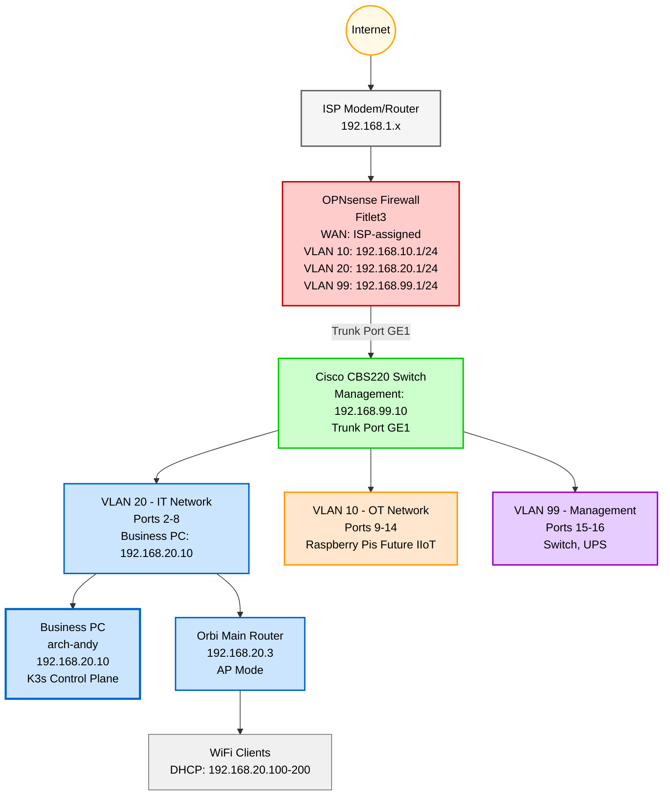

**See the [Homelab GitHub Repo](https://github.com/aott33/iiot-kubernetes-homelab)**

**Week:** 3 of 16

---

## Introduction

This week was supposed to be about Kubernetes. It became a masterclass in Arch Linux installation troubleshooting instead.

I spent hours debugging an encrypted Arch Linux installation that refused to boot and learned to follow the recommended installation guide.

## Background & Context

This is week 3 of a 16-week journey documenting my Homelab building process. Week 1 established the network foundation with OPNsense and WiFi. Week 2 added VLAN segmentation for OT/IT security. This week was meant to deploy the Kubernetes control plane on my gaming PC, but hardware had other plans.

**Hardware obstacle:** My gaming PC wouldn't power on this week. It tripped the circuit breaker immediately on startup, indicating a power supply or motherboard fault. Rather than delay the project for hardware troubleshooting, I pivoted to using my business PC as the K3s control plane instead.

Before starting this week, I had never installed Arch Linux. I'd used Ubuntu and other Debian-based distros, but Arch's manual installation process was new to me. I chose Arch because of the learning opportunity, it's the foundation for the K3s control plane that will run my IIoT platforms.

**This week's goals:**
1. Install Arch Linux on Business PC (IP: 192.168.20.10)
2. Deploy K3s control plane (server mode) with no workload scheduling
3. Verify control plane health and accessibility
4. Document baseline resource usage

**What actually happened:**
1. Installed Arch Linux
2. Did not deploy K3s control plane
3. Did not verify control plane
4. Did not document resource usage

> This post covers the troubleshooting journey from encrypted installation failures to a working base system, the lessons learned about installation complexity, and why official documentation beats tutorials most of the time.

## Network Topology

The business PC joins the IT VLAN as the first Kubernetes control plane node (originally planned for the gaming PC, which experienced hardware failure):



*Red: Routing/Firewall* <br>
*Green: Switch/VLANs* <br>
*Blue: IT Network (VLAN 20), Business PC added* <br>
*Orange: OT Network (VLAN 10)* <br>
*Purple: Management (VLAN 99)* <br>

---

## The YouTube Tutorial Rabbit Hole

I started with what seemed like a reasonable approach: follow a YouTube tutorial for Arch Linux installation. I found [this video](https://www.youtube.com/watch?v=FxeriGuJKTM) that walked through an encrypted installation with LVM.

The tutorial was detailed and professional. It covered disk encryption, LVM, and bootloader configuration. I thought this would be the ideal approach even though I read in forums to just follow the Installation Wiki.

**Main Installation Steps I followed**
1. Created bootable USB with Arch ISO
2. Partitioned disk with encrypted LVM (following tutorial)
3. Installed base system with `pacstrap`
4. Configured `mkinitcpio.conf` hooks for encryption
5. Installed GRUB bootloader
6. Generated `/etc/fstab`
7. Set root password and created user
8. Rebooted

**What happened:** The system booted directly into the MSI BIOS, completely bypassing the hard drive.

My first thought was the bootloader didn't install correctly and followed the video again and reinstalled the Arch Linux. After searching, I discovered MSI motherboards have a known quirk: they ignore custom UEFI boot entries and only boot from the fallback path `/EFI/BOOT/BOOTX64.EFI`.

The solution: Install GRUB with the `--removable` flag.

```shell
grub-install --target=x86_64-efi --efi-directory=/boot --bootloader-id=GRUB --removable
```

This installs GRUB to the standard fallback location that MSI motherboards recognize automatically.

**Result:** GRUB menu appeared! Progress!

But selecting "Arch Linux" from the menu resulted in a blank screen with error messages about timeouts.

---

## The Encryption Configuration Maze

With GRUB working, the next challenge was getting the system to actually boot. The error messages revealed the core issue (Not exact message):

```shell
[ TIME ] Timed out waiting for device /dev/mapper/volgroup0-lv_root
[ DEPEND ] Dependancy failed for File System mk on /dev/mapper/volgroup0-lv_root
[ DEPEND ] Dependancy failed for /sysroot
[ DEPEND ] Dependancy failed for Initrd Root File System
[ DEPEND ] Dependancy failed for Mountpoints configured in Real Root
[ DEPEND ] Dependancy failed for Initrd Root Device
You are in emergency mode. After logging in, type "journalctl -xb" to view systeme logs, "systemctl reboot" to reboot or "exit" to conitinue bootup

Cannot open access to console, the root acount is locked.
See sulogin(8) man page for more detauls

Press Enter to Continue
```

The system couldn't find the encrypted root partition.

I went through the install again and followed the tutorial exactly and it still ended with a blank screen and then timeout error. I tried many things based on the forums and ended up in the same spot. I must have missed a key configuration somewhere.

### The Realization

After multiple rounds of:
1. Boot from USB
2. Unlock encrypted partition with `cryptsetup open`
3. Mount filesystems
4. `arch-chroot` into installation
5. Edit configuration files
6. Regenerate initramfs with `mkinitcpio`
7. Regenerate GRUB config
8. Reboot and test
9. Watch it fail again

I realized something: **I was spending more time debugging encryption than I would spend setting up encryption later.**

The tutorial made encryption seem essential from the start. But for a homelab Kubernetes node on a private VLAN behind a firewall, was full-disk encryption truly necessary right now?

---

## The Fresh Start Decision

Sometimes the best troubleshooting decision is knowing when to stop troubleshooting and start fresh.

I made the call to reinstall with a simple, non-encrypted setup:
- **Partition 1:** 1GB EFI System Partition (FAT32) mounted to `/boot`
- **Partition 2:** Remaining space ext4 root partition
- **No encryption, no LVM, no complexity**

This time, I followed the [official Arch Wiki Installation Guide](https://wiki.archlinux.org/title/Installation_guide) instead of a YouTube tutorial.

**Arch Wiki Approach:**
- Explains *why* each step matters, not just *what* to do
- Covers multiple scenarios and alternatives
- Updated continuously by the community
- Teaches you to fish instead of giving you a fish

**Time to working system:**
- Encrypted installation attempts: ~6 hours across multiple days
- Simple installation following Wiki: ~45 minutes

---

## The Simple Installation That Worked

Here's the condensed version of what actually worked:

### 1. Partition the Disk

```shell
fdisk /dev/nvme0n1

# Commands entered:
g         # Create GPT partition table
n         # New partition 1 (EFI)
<Enter>
<Enter>
+1G
t         # Change type to EFI System
1

n         # New partition 2 (Swap)
<Enter>
<Enter>
+2G
t         # Change type to Linux Swap
19

n         # New partition 3 (Root)
<Enter>
<Enter>
<Enter>   # Use remaining space

w         # Write changes
```

### 2. Format and Mount

```shell
# Format partitions
mkfs.fat -F32 /dev/nvme0n1p1
mkswap /dev/nvme0n1p2
mkfs.ext4 /dev/nvme0n1p3

swapon /dev/nvme0n1p2

# Mount root first
mount /dev/nvme0n1p3 /mnt

# Create boot directory and mount EFI
mkdir /mnt/boot
mount /dev/nvme0n1p1 /mnt/boot
```

**Critical lesson:** Always mount root to `/mnt` *first*, then create subdirectories for other mount points. Attempting to mount `/mnt/boot` before `/mnt` exists results in "mount point does not exist" errors.

### 3. Install Base System

```shell
pacstrap -K /mnt base linux linux-firmware linux-headers linux-lts linux-lts-headers

# Generate fstab
genfstab -U /mnt >> /mnt/etc/fstab

# Verify fstab is correct
cat /mnt/etc/fstab
```

The `-U` flag uses UUIDs instead of device names, which is more reliable if disk order changes.

### 4. Configure System

```shell
# Chroot into new system
arch-chroot /mnt

# Set timezone
ln -sf /usr/share/zoneinfo/Canada/Pacific /etc/localtime
hwclock --systohc

# Set locale
nano /etc/locale.gen  # Uncomment en_US.UTF-8 UTF-8
locale-gen
echo "LANG=en_US.UTF-8" > /etc/locale.conf

# Set hostname
echo "arch-andy" > /etc/hostname

# Install essential packages
pacman -S base-devel dosfstools grub efibootmgr gnome gnome-tweaks mtools nano networkmanager openssh sudo

# Set root password
passwd

# Create user
useradd -m -G wheel -s /bin/bash andy
passwd andy

# Enable sudo for wheel group
EDITOR=nano visudo
# Uncomment: %wheel ALL=(ALL:ALL) ALL

# Enable services
systemctl enable gdm
systemctl enable NetworkManager
```

### 5. Install Bootloader (MSI-Compatible)

```shell
# Install GRUB with --removable flag for MSI motherboards
grub-install --target=x86_64-efi --efi-directory=/boot --bootloader-id=GRUB --removable

# Generate GRUB configuration
grub-mkconfig -o /boot/grub/grub.cfg

# Verify GRUB found the kernel
# Output should show "Found linux image: /boot/vmlinuz-linux"
```

### 6. Reboot

```shell
exit
umount /mnt/boot
umount /mnt
shutdown now
```

Remove the USB drive, power on, and...

**GRUB menu appeared with "Arch Linux" option. Selected it. System booted to a text login.**

Success! Well, almost.

---

## The Final Hurdle: GDM Not Starting

The system booted to TTY1 (text login) instead of the graphical GNOME login screen (GDM). After logging in, I checked the status:

```shell
systemctl status gdm
# Output: loaded (disabled; preset: disabled)
#         Active: inactive (dead)
```

GDM wasn't enabled, even though I ran `systemctl enable gdm` during installation.

**The fix:**
```shell
sudo systemctl enable gdm
sudo systemctl start gdm
```

The screen immediately switched to the graphical GNOME login.

---

## Post-Installation Configuration Gotchas

After logging into the GNOME desktop, I discovered a few configuration items that didn't carry over from the chroot environment.

### Missing Locale Configuration

Even though I ran `locale-gen` during installation, the `/etc/locale.conf` file wasn't being read properly.

**The fix:**
```shell
# Regenerate locales
sudo locale-gen

# Verify locale is set
localectl status
# Should show: System Locale: LANG=en_US.UTF-8
```

### Timezone Not Configured

I assumed setting the timezone during installation would persist, but checking the system time revealed it was using UTC:

**The fix:**
```shell
# Set timezone (adjust for your region)
sudo ln -sf /usr/share/zoneinfo/Canada/Pacific /etc/localtime

# Update hardware clock
sudo hwclock --systohc

# Verify
timedatectl
# Time zone: America/Vancouver (PST, -0800)
```

**Lesson learned:** After first boot, verify critical settings like locale, timezone, and network configuration. Always test and verify after the first boot.

**Note:** The Arch Wiki has a comprehensive [General Recommendations](https://wiki.archlinux.org/title/General_recommendations) page covering system administration tasks after installation. It includes security hardening, user management, network configuration, and performance optimization. Worth reviewing before deploying production workloads.

---

## Topics to Explore Deeper

This installation exposed several Linux concepts I want to understand more thoroughly:

### 1. **LVM (Logical Volume Manager)**

I attempted LVM during the encrypted installation but didn't fully grasp how it works. LVM provides flexibility (resize partitions, add disks, create snapshots) that could be valuable for Kubernetes persistent storage.

**Why it matters for this project:** When I deploy Longhorn distributed storage (Week 6?), understanding volume management will help troubleshoot storage issues.

**Next steps:**
- Read the [Arch Wiki LVM guide](https://wiki.archlinux.org/title/LVM)
- Experiment with LVM in a VM before implementing on production systems
- Consider LVM for future Raspberry Pi storage configuration

### 2. **Pacman Package Manager**

I used `pacman` to install packages, but I don't understand package management beyond the basics:
- What's the difference between `-S`, `-Syu`, `-Ss`, `-R`, `-Rns`?
- How do AUR (Arch User Repository) packages work?
- How does pacman handle dependency resolution?
- What are package groups vs individual packages?

**Why it matters:** I'll be installing Kubernetes tools (kubectl, helm, k9s), monitoring agents, and development tools. Understanding package management prevents broken dependencies and system instability.

**Next steps:**
- Read the [Pacman Rosetta](https://wiki.archlinux.org/title/Pacman/Rosetta) (compares pacman to apt, dnf, etc.)
- Learn AUR helper usage (yay or paru)
- Set up regular system updates workflow

### 3. **Systemd and Service Management**

I used `systemctl enable` and `systemctl start` without understanding the systemd service lifecycle:
- What's the difference between `enable` and `start`?
- How do service dependencies work?
- What are systemd targets (like `multi-user.target` vs `graphical.target`)?
- How do you create custom systemd services?

**Why it matters:** K3s runs as a systemd service. When I deploy custom Go applications (Week 14), I'll need to create systemd units for them.

**Next steps:**
- Read [Systemd documentation](https://wiki.archlinux.org/title/Systemd)
- Examine existing service files: `systemctl cat gdm`, `systemctl cat NetworkManager`
- Practice creating a simple custom service

### 4. **Initramfs and Boot Process**

The encryption troubleshooting forced me to learn about initramfs, but I still don't fully understand:
- What exactly is initramfs and when does it run?
- How do hooks in `/etc/mkinitcpio.conf` affect boot?
- What's the boot sequence: UEFI → GRUB → Kernel → Initramfs → Root filesystem?
- How does the kernel hand off to systemd?

**Why it matters:** Understanding boot processes helps troubleshoot kernel panics, driver issues, and boot failures. If a Kubernetes node fails to boot, I need to know how to recover it.

**Next steps:**
- Read [Arch boot process documentation](https://wiki.archlinux.org/title/Arch_boot_process)
- Understand GRUB kernel parameters (especially for K3s networking)
- Learn how to boot into rescue mode

### 5. **UEFI vs BIOS Boot**

Why does MSI require the `--removable` flag? What's the difference between UEFI boot entries and the fallback path? How does Secure Boot fit into this?

**Why it matters:** If I need to reinstall or migrate systems, understanding UEFI prevents boot failures.

**Next steps:**
- Learn about EFI System Partition structure
- Understand `efibootmgr` for managing boot entries
- Research Secure Boot implications for custom kernels

---

These gaps won't block K3s deployment, but filling them will make me more effective at troubleshooting when things break. The Arch Wiki will be my companion for these deep dives.

---

## Summary & Lessons Learned

Week 3 is finally complete. I installed Arch Linux on the business PC after a humbling journey through hardware failure (gaming PC tripped circuit breaker, suspected PSU/motherboard fault), encryption troubleshooting, UEFI quirks, and configuration errors. The K3s control plane deployment moves to Week 4.

**What worked well:**
- **MSI `--removable` flag discovery:** Solved the initial boot failure
- **Switching to the Arch Wiki:** Official documentation is always superior to tutorials for critical infrastructure
- **Fresh start decision:** Knowing when to abandon a broken approach saved hours of additional debugging

**What didn't work:**
- **Following YouTube tutorial blindly:** Encryption added complexity I didn't need yet

**The biggest lesson: Complexity has a cost**

Encryption is valuable. LVM is powerful. But adding them *during initial installation* on a homelab system increased failure modes. I needed a working foundation first.

Next week: K3s control plane deployment (for real this time).

---

## Next Week Preview

**Week 4: K3s Control Plane - Building the Kubernetes Foundation**

With Arch Linux installed and working, I'm finally ready to deploy the Kubernetes control plane. This week I'm tackling:

1. K3s server installation on arch-andy
2. Control plane configuration (no workload scheduling)
3. Verify cluster health with `kubectl`
4. Document baseline resource usage
5. Prepare for worker node addition in Week 5

This is my first time deploying Kubernetes from scratch, so expect some learning moments.

Follow along as we finally get to the Kubernetes part of this Kubernetes homelab project!

---

## Resources & Links

**Arch Linux Documentation:**
- [Arch Linux Installation Guide](https://wiki.archlinux.org/title/Installation_guide): The official guide
- [Arch Linux Download](https://archlinux.org/download/): ISO images and torrents
- [General Recommendations](https://wiki.archlinux.org/title/General_recommendations): Post-installation configuration

**Tutorial I Followed (Initially):**
- [YouTube: Arch Linux Installation Tutorial](https://www.youtube.com/watch?v=FxeriGuJKTM): Good tutorial

**Troubleshooting Resources:**
- [MSI Motherboard Boot Issue](https://bugs.archlinux.org/task/70408): UEFI boot quirks
- [GitHub: PiKVM FSTAB Issue](https://github.com/pikvm/pikvm/issues/709): Helped diagnose mount problems

**Homelab Repository:**
- [Homelab Repo](https://github.com/aott33/iiot-kubernetes-homelab)

**Writing Framework:**
- [The Algorithmic Framework for Writing Good Technical Articles](https://www.theocharis.dev/blog/algorithmic-framework-for-writing-technical-articles/)