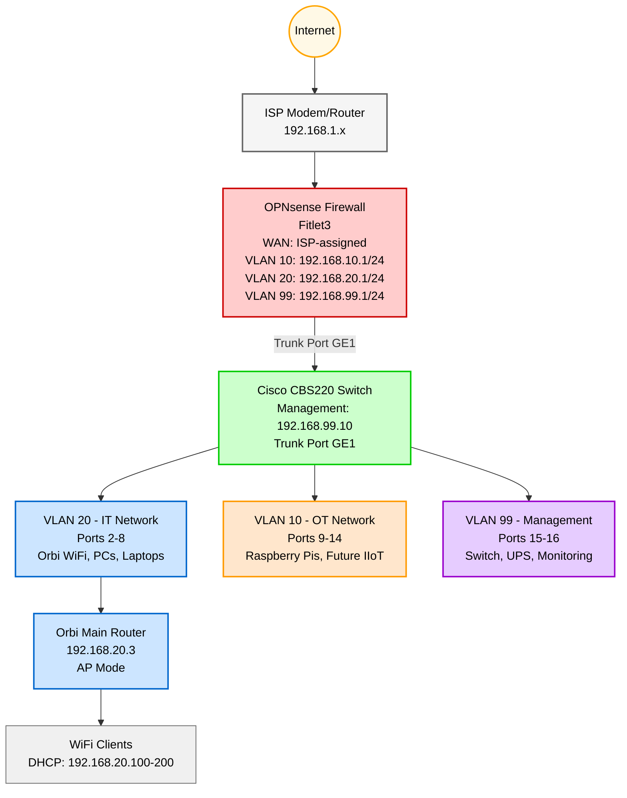

## Network Segmentation for OT/IT Security

**See the [Homelab GitHub Repo](https://github.com/aott33/iiot-kubernetes-homelab)**

**Week:** 3 of 16

---

## Introduction

TODO

## Background & Context

UPDATE BELOW
This is week 2 of a 16-week journey documenting my Homelab building process. Week 1 established the foundation with OPNsense routing and WiFi coverage. This week builds on that foundation by adding security through network segmentation.

Before starting this week I had a high-level understanding of VLANs. Now I can confidently say I know what they are, how they work, and how to configure them. It was quite a journey with a few hurdles that I needed to jump over.

**This week's goals:**
1. Install Arch Linux on Business PC (IP: 192.168.20.10)
2. Deploy K3s control plane (server mode) with no workload scheduling
3. Verify control plane health and accessibility
4. Document baseline resource usage

> This post covers Kubernetes fundamentals, configuring Arch Linux, and deploying K3s control plane.

## Network Topology

UPDATE BELOW
Here's the network architecture after this week's implementation:



*Red: Routing/Firewall* <br>
*Green: Switch/VLANs* <br>
*Blue: IT Network (VLAN 20)* <br>
*Orange: OT Network (VLAN 10)* <br>
*Purple: Management (VLAN 99)* <br>


*Server rack with Cisco CBS220 switch, OPNsense Fitlet3, and Orbi WiFi mesh system mounted and ready for VLAN configuration*

---

## Kubernetes Fundamentals

When the Cisco CBS220 switch arrived, I was eager to get it working. I powered it up, connected it to my network, and started using it as a basic unmanaged switch. Everything worked fine on the flat `192.168.20.0/24` network.

Then I realized: I'd created extra work for myself.

Now I needed to configure VLANs on both OPNsense and the switch, move the switch from `192.168.20.2` to `192.168.99.10` (Management VLAN), update DHCP reservations, and potentially lose access requiring ethernet reconnection. If I had planned first and configured VLANs in OPNsense before connecting the switch, it would have gone straight to the Management VLAN with no migration needed.

---

## Installing and Configuring Arch Linux

TODO: Step Intro?

### 1. Download ISO

Prequisites: BitTorrent Client
- Download qBittorrent: [https://www.qbittorrent.org/download.php](https://www.qbittorrent.org/download.php)
- Install it, then use the magnet/torrent link below

**Steps:**
1. On the Arch Linux download page, look for **BitTorrent Download (recommended)**
2. Click [Magnet link for 2025.11.01](magnet:?xt=urn:btih:d4487f489d4ee786f99bcdeeb8d3f226694ea27f&dn=archlinux-2025.11.01-x86_64.iso) (or [Torrent for 2025.11.01(https://archlinux.org/releng/releases/2025.11.01/torrent/)])
3. Your BitTorrent client will open automatically
4. Select download location and click "OK"
5. Wait for download to complete (shows "Seeding" when done)
6. The ISO file will be in your download location

TODO: Image/Screenshot?

### 2. Create Bootable USB Drive

TODO: Step Intro?

**Steps:**
**Windows (Using Rufus):**
1. **Download Rufus:** [https://rufus.ie/](https://rufus.ie/)
2. **Insert USB drive** (8GB+, **all data will be erased**)
3. **Run Rufus:**
   - Device: Select your USB drive
   - Boot selection: Click "SELECT" → choose Arch Linux ISO
   - Partition scheme: **GPT**
   - Target system: **UEFI (non-CSM)**
   - File system: **FAT32**
   - Cluster size: **16 kilobytes (default)**
4. **Click START** → Wait for completion (~5 minutes)
5. **Safely eject USB drive**

**Screenshot Needed:**
- [ ] Rufus settings before writing ISO (see C:\Users\AndrewOtt\Desktop\Dev\iiot-homelab\docs\blog-posts\images\week-3-rufus-start-flash.png)

### 3. Install Arch Linux Base System

#### 3.1 Boot from USB and Verify Network

1. **Insert USB drive** into Business PC
2. **Reboot** and press `F12` (or `DEL`/`F2` depending on motherboard) to access boot menu
3. **Select USB drive** from boot menu
4. **Wait for Arch Linux boot menu** → Select "Arch Linux install medium"
5. **Wait for root prompt:** `root@archiso ~ #`

**Verify internet connectivity:**
```bash
# Test network connection
ping -c 3 archlinux.org

# Expected output:
# 64 bytes from archlinux.org: icmp_seq=1 ttl=56 time=15.2 ms
# ...
# 3 packets transmitted, 3 received, 0% packet loss
```

**If ping fails:**
```bash
# Check ethernet interface status
ip link

# You should see 'enp0s31f6' or similar with 'state UP'
# If state is DOWN:
ip link set enp0s31f6 up

# Try DHCP again
dhcpcd enp0s31f6
```

#### 3.2 Partition the Disk

**First, identify your disk device:**

```bash
# List all available disks
lsblk

# Common device names:
# - /dev/sda (SATA SSD/HDD)
# - /dev/nvme0n1 (NVMe SSD)
# Look for your 250GB SSD (shows as ~232G due to formatting)
```

**Disk layout we're creating:**

| Partition | Size | Type | Mount Point | Purpose |
|-----------|------|------|-------------|---------|
| `/dev/sda1` (or nvme0n1p1) | 512MB | EFI | `/boot` | UEFI boot files |
| `/dev/sda2` (or nvme0n1p2) | Remaining | ext4 | `/` | Root filesystem |

**Partition the drive (replace `/dev/sda` with your disk from lsblk output):**

```bash
# Start partitioning tool (ADJUST DEVICE NAME BASED ON lsblk OUTPUT)
fdisk /dev/sda

# Inside fdisk, type the following commands:
# (Press Enter after each command)

g         # Create new GPT partition table
n         # New partition (1 - EFI)
1         # Partition number
<Enter>   # Default first sector
+512M     # Size (512MB for EFI)
t         # Change partition type
1         # EFI System

n         # New partition (2 - Root)
2         # Partition number
<Enter>   # Default first sector
<Enter>   # Default last sector (use all remaining space)

w         # Write changes and exit
```

**Format the partitions (ADJUST DEVICE NAME):**

```bash
# Format EFI partition as FAT32
mkfs.fat -F32 /dev/sda1

# Format root partition as ext4
mkfs.ext4 /dev/sda2

# Verify partitions created
lsblk
# You should see:
# sda         232G
# ├─sda1      512M  (EFI)
# └─sda2      231G  (Linux filesystem)
```

**Mount the filesystems (ADJUST DEVICE NAME):**

```bash
# Mount root partition
mount /dev/sda2 /mnt

# Create boot directory and mount EFI partition
mkdir -p /mnt/boot
mount /dev/sda1 /mnt/boot

# Verify mounts
lsblk
# Should show /mnt and /mnt/boot mount points
```

#### 3.3 Install Base System

**Install essential packages:**

```bash
# Install base system + essential packages
pacstrap /mnt base linux linux-firmware \
  base-devel \
  networkmanager \
  vim \
  sudo \
  git

# This will download ~500MB of packages and take 5-10 minutes
```

**What we're installing:**
- `base`: Arch Linux base system
- `linux`: Latest Linux kernel
- `linux-firmware`: Firmware files for hardware
- `base-devel`: Development tools (gcc, make, etc. - needed for AUR)
- `networkmanager`: Network management (easier than manual netctl)
- `vim`: Text editor (or use `nano` if you prefer)
- `sudo`: Run commands as root
- `git`: Version control (needed for K3s installation)

**Generate filesystem table:**

```bash
# Generate /etc/fstab (filesystem mount configuration)
genfstab -U /mnt >> /mnt/etc/fstab

# Verify fstab looks correct
cat /mnt/etc/fstab
# Should show (device names will match your drive):
# UUID=xxxxx  /      ext4  ...
# UUID=xxxxx  /boot  vfat  ...
```

#### 3.4 Chroot and Configure System

**Enter new system:**

```bash
# Change root into new system
arch-chroot /mnt
```

You're now inside the new Arch Linux system!

**Set timezone:**

```bash
# Set timezone (adjust for your location)
ln -sf /usr/share/zoneinfo/America/New_York /etc/localtime

# Sync hardware clock
hwclock --systohc
```

**Set locale:**

```bash
# Edit locale.gen and uncomment your locale
vim /etc/locale.gen
# Uncomment: en_US.UTF-8 UTF-8

# Generate locales
locale-gen

# Set system locale
echo "LANG=en_US.UTF-8" > /etc/locale.conf
```

**Set hostname:**

```bash
# Set hostname
echo "k3s-control" > /etc/hostname

# Configure /etc/hosts
cat << EOF > /etc/hosts
127.0.0.1   localhost
::1         localhost
127.0.1.1   k3s-control.homelab.local k3s-control
EOF
```

**Set root password:**

```bash
# Set root password (choose a strong password)
passwd

# Enter new password (it won't display as you type)
# Re-enter to confirm
```

**Create non-root user:**

```bash
# Create your user account (replace 'andrew' with your username)
useradd -m -G wheel -s /bin/bash andrew

# Set user password
passwd andrew

# Enable sudo for wheel group
EDITOR=vim visudo
# Uncomment this line:
# %wheel ALL=(ALL:ALL) ALL
```

#### 3.5 Install and Configure Bootloader

**Install GRUB bootloader:**

```bash
# Install GRUB and EFI tools
pacman -S grub efibootmgr

# Install GRUB to EFI partition
grub-install --target=x86_64-efi --efi-directory=/boot --bootloader-id=GRUB

# Generate GRUB configuration
grub-mkconfig -o /boot/grub/grub.cfg
```

**Enable NetworkManager:**

```bash
# Enable NetworkManager to start on boot
systemctl enable NetworkManager
```

**Exit chroot and reboot:**

```bash
# Exit chroot
exit

# Unmount partitions
umount -R /mnt

# Reboot (remove USB drive when prompted)
reboot
```

**Verify boot:**
- System should boot to GRUB menu
- Select "Arch Linux" (default)
- Should reach login prompt: `k3s-control login:`
- Login as your user (not root)

**Screenshot Needed:**
- [ ] Arch Linux boot screen
- [ ] Successful login prompt

---

## Resources & Links

**Arch Linux Documentation:**
- [Arch LInux Installation Guide](https://wiki.archlinux.org/title/Installation_guide)
- [Arch Linux Download](https://archlinux.org/download/)

**Homelab Repository:**
- [Homelab Repo](https://github.com/aott33/iiot-kubernetes-homelab)

**Writing Framework:**
- [The Algorithmic Framework for Writing Good Technical Articles](https://www.theocharis.dev/blog/algorithmic-framework-for-writing-technical-articles/)