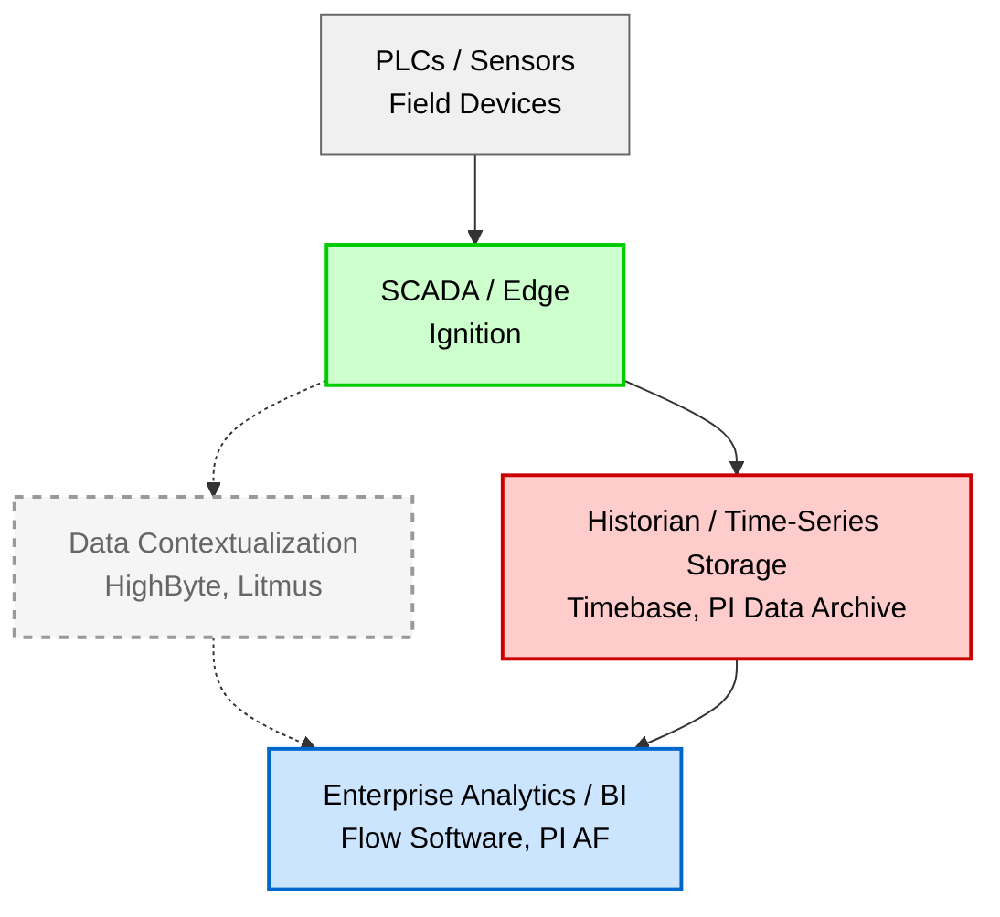
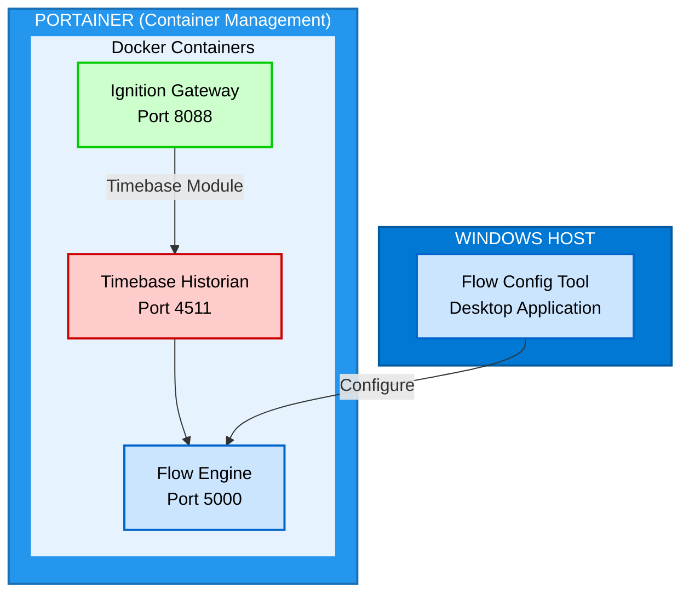
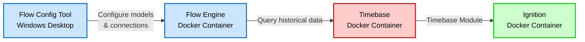
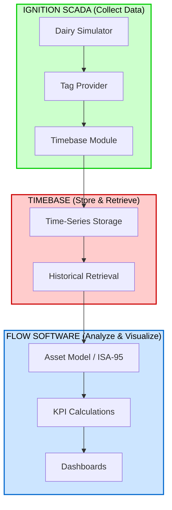
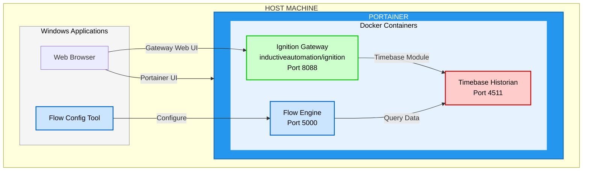

## Introduction

With all the industrial data analytics platforms on the market it can be quite confusing to determine what each one does. This was my exact understanding prior to digging into some key platforms. I heard of Highbyte, Litmus, and Flow but I didn't understand the key differences between each of them. 

As a SCADA developer expanding into data architecture, I kept hearing the same platforms mentioned: PI Asset Framework, HighByte, Flow Software, Litmus. But I couldn't articulate *when* to use each one or *why* they exist in different layers of the stack. 

So, I decided to dig into is over the Christmas holidays. Using Ignition's Dairy Simulator as my data source, I'm implementing a complete data pipeline from edge collection through analytics using Timebase and Flow Software. This post documents my learning journey, I started with Flow's training and certification program and then I began to build a project using the Ignition Dairy Simulator

## Background & Context

The industrial data challenge is simple to state but difficult to solve: **data is collected at the edge, but value is created higher up.**

PLCs and sensors generate millions of data points. SCADA systems display them. But turning that raw data into actionable insights such OEE calculations, predictive maintenance alerts, energy optimization requires an industrial stack.



*Solid lines: The stack I built (Ignition → Timebase → Flow)*
*Dashed lines: Optional contextualization layer (HighByte, Litmus)*

Each layer has a job. Understanding those jobs and which tools belong where is the goal of this project. Specifically looking into where Flow Software fits in the stack.

> This post covers three platforms hands-on: Ignition (data collection), Timebase (historian with native Ignition integration), and Flow Software (analytics). I'll also discuss PI Asset Framework as the enterprise benchmark and HighByte as an optional contextualization layer.

---

## The Stack I Built

For this project, I kept the architecture simple and containerized as much as possible using Docker managed through Portainer:

```
Ignition (Dairy Simulator) → Timebase (Historian) → Flow Engine → Flow Config Tool
      [Docker]                   [Docker]           [Docker]       [Windows]
```

This mirrors the PI ecosystem structure (PI Interfaces → PI Data Archive → PI AF) but with Ignition/Flow Software.

### Deployment Architecture



**Why Docker?** Containerizing the stack provides:
- Repeatable deployments across environments
- Easy version management and rollbacks
- Isolation between services
- Simplified backup and migration

**Why Windows for Flow Config Tool?** The Flow Config Tool is a desktop application that's only available for Windows. It connects to the Flow Engine (running in Docker) to configure your asset models, connections, and transformations.

Why skip the contextualization layer? For many deployments, as far as I understand, **Flow Software handles both contextualization AND analytics**. It builds asset hierarchies, creates templates, and adds ISA-95 structure. You don't always need a separate tool like HighByte. However, there are cases where it makes sense such as... [TO DO] what are use cases for highbyte and flow software?

While digging into the Flow Software use case, I was recommended by an expert in the industry to dig into PI Asset Framework to help understand what Flow Software actually does.

---

## PI Asset Framework: The Enterprise Benchmark

As I stated above, a good approach to understand Flow Software is to dig into it's competitor PI Asset Framework (PI AF). It's the dominant enterprise platform with 40+ years of OSIsoft heritage (now AVEVA).

### What PI AF Does

PI AF sits on top of the PI Data Archive (historian) and adds a context layer and more (from modeling data to creating dashboards). Instead of just storing `Tag_123 = 127.3`, PI AF lets you say "This is the discharge pressure of Compressor 01, which is part of the Refrigeration system, which is in Building A."

**Core concepts:**

- **Element Hierarchy:** Organize elements in parent-child relationships (Site → Area → Line → Equipment)
- **Asset Metadata:** Add context to the data
- **Templates:** Create reusable asset definitions
- **Asset Analytics:** Draft equations to track and analyze the process
- **Event Frames:** Capturing process events, batches, and state changes and notify key personnel
- **Visualize:** Create dashboards to visualize the contextualized data

### Why PI AF Matters

Even if you never use PI AF directly, understanding it helps you:

1. **Communicate with clients** who have existing PI installations
2. **Position modern alternatives** like Flow Software, compare and contrast the platforms
3. **Understand asset modeling concepts** that appear in every industrial data platform

With that brief primer on the AVEVA PI Asset Framework completed, let's work through the stack I developed starting with the historian.

---

## Timebase: The Historian with Native Ignition Integration

Before data can be analyzed, it needs to be stored. That's where historians come in. Timebase is Flow Software's historian, and it has something that sets it apart: **native Ignition integration via their recently released Ignition module**.

### Where Timebase Fits

In the PI ecosystem, you have PI Data Archive (historian) + PI AF (context/analytics). In the Flow ecosystem, you have Timebase (historian) + Flow Information Hub (context/analytics).

The Timebase Module for Ignition acts as both a **Storage Provider** and **Tag History Provider**.

### Why Native Ignition Integration Matters

Most historians require additional configuration: OPC connections, data bridges, or custom scripting. The Timebase Ignition module eliminates this complexity.

### Hands-On: Dairy Simulator with Timebase

Setting up Timebase with the Dairy Simulator was straightforward. Both Ignition and Timebase run as Docker containers managed through Portainer.

**Prerequisites**
1. **Docker Host with Portainer** - I used Portainer to manage my containers
2. **Ignition 8.3 Container** - Running the Dairy Simulator
   - See [Ignition Docker Image](https://hub.docker.com/r/inductiveautomation/ignition)
3. **Timebase Historian Container**
   - See the [Quick Start for Docker & Images](https://timebase.flow-software.com/en/knowledge-base/quick-start-for-docker)

**Step 1: Install the Module**

- [Download](https://sentry.flow-software.com/download/Timebase.Historian-8.3.1-b2025111216.modl) the free Timebase Module from Flow Software and install it through Ignition's Gateway interface.
- Gateway restart required.

**Step 2: Create Historian Instance**

- From the Ignition Gateway, select 'Services' from the left-hand menu, then select 'Historians' from the Overview section. 
- Select the 'Create Historian +' button from the upper right hand corner.
- Select 'Timebase Historian' at the bottom of the list of available Storage Providers and click 'Next'.

**Step 3: Configure Historian**

- Note: This configuration sets Timebase Historian as both an Ignition Storage Provider as well as an Ignition Tag History Provider
- Minimal configuration is required, primarily the URL for the location of your Timebase Historian, and if you choose to use security, the appropriate Pulse URL and credentials.

**Step 3: Enable Tag History**

- Set History Enabled to True
- Set the Storage Provider from to Timebase.

**Step 4: Verify Data Flow**

- Create a view with a PowerChart and confirm data is being historized

### Key Takeaway

Timebase solves the historian problem for Ignition-centric environments. No OPC bridges, no custom scripting. Just install the module and enable history on your tags. The data flows to Timebase and becomes available to Flow for analytics.

---

## Flow Software Information Hub: The Analytics Platform

Flow Software competes directly with PI Asset Framework. It's a full analytics platform: asset modeling, KPI calculations, dashboards, and enterprise integration.

> A Timebase Historian plus InfoHub architecture keeps the strengths of AF but removes the licensing, storage, and integration constraints that come with AVEVA. You keep the intent of AF and gain a modern foundation built for scale. Source: [Comparing PI AF Pricing to a Timebase and InfoHub Architecture](https://www.flow-software.com/articles/migrating-from-pi-af-to-a-timebase-and-infohub-architecture)

### The 5-Step Workflow

Flow organizes its functionality into five steps:

1. **Model:** Build asset hierarchy with templates and instances
2. **Connect:** Link to data sources (OPC UA, MQTT, Sparkplug B, Timebase)
3. **Transform:** Calculate KPIs, aggregations, and derived values
4. **Publish:** Output to external systems (cloud, databases, APIs)
5. **Visualize:** Build dashboards with the application of your choice, ex. Ignition Perspective

### Flow Software Components

Flow Software consists of two main components:

1. **Flow Engine** (Docker) - The runtime that executes your models, connects to data sources, and serves data to visualization tools
2. **Flow Config Tool** (Windows only) - The desktop application where you build asset models, configure connections, and define transformations



### Hands-On: Dairy Simulator in Flow

With Timebase already collecting historical data from the Dairy Simulator, connecting Flow was straightforward. The Flow Engine runs in Docker alongside Ignition and Timebase, while the Flow Config Tool runs on my Windows machine.

**Asset Model:**

Created an ISA-95 hierarchy for the dairy plant:

```
Dairy_Plant (Enterprise)
└── Main_Facility (Site)
    ├── Refrigeration (Area)
    │   ├── Compressor_01
    │   ├── Compressor_02
    │   └── Chiller_Tank_01
    └── Processing (Area)
        ├── Pasteurizer_01
        └── Storage_Tank_01
```

Built templates for reusable equipment definitions:
- Compressor Template (discharge pressure, suction pressure, running status, current)
- Tank Template (level, temperature, pressure)
- Motor Template (running, speed, current draw)

**Data Connection:**

Connected Flow directly to Timebase. The historical data collected through the Ignition module was immediately available for analysis—no additional configuration needed.

**KPI Calculations:**

Defined calculated fields that update automatically:
- **Compressor Runtime Hours:** Accumulated running time
- **Tank Fill Percentage:** Current level / max capacity
- **Refrigeration Efficiency:** Output BTU / input kW

**Dashboard:**

Built an operational overview in Perspective showing:
- Compressor status cards (running/stopped, current load)
- Tank level trends over 24 hours
- KPI summary with threshold indicators

The entire process—from raw Ignition tags to executive dashboard—took an afternoon. Compare that to a PI AF + PI Vision deployment.

---

## What About HighByte? (The Contextualization Layer)

You might be wondering why I didn't include HighByte in my hands-on stack. The answer: **Flow Software already handles contextualization**.

HighByte Intelligence Hub is a dedicated data contextualization platform. It sits between your SCADA system and analytics platforms, transforming raw tag data into clean, structured payloads. It's similar to Litmus.

**HighByte's core concepts:**
- **Types:** Data model definitions (like UDTs for data payloads)
- **Instances:** Actual assets created from types
- **Flows:** Pipelines that transform and route data
- **ISA-95 Structure:** Hierarchical organization of assets

### When You Need HighByte (or Similar)

?

### When Flow Is Enough

?

My Dairy Simulator project fell into the second category. Flow's built-in asset modeling, templates, and ISA-95 hierarchy covered everything I needed.

---

## Complete Integration Architecture

Here's the full stack I built, showing both the logical data flow and the deployment architecture:

### Data Flow Architecture



### Docker Deployment Architecture



**Each layer has a distinct responsibility:**

| Layer | Tool | Deployment | Responsibility |
|-------|------|------------|----------------|
| Collection | Ignition | Docker | Read PLC data, expose tags, run Dairy Simulator |
| Storage | Timebase | Docker | Store time-series data via native module |
| Analytics Engine | Flow Engine | Docker | Execute models, serve data |
| Analytics Config | Flow Config Tool | Windows | Build asset models, configure connections |

### Platform Comparison Summary

| Platform | Category | Similar To | When to Use |
|----------|----------|------------|-------------|
| Timebase | Historian | PI Data Archive, Canary | Native Ignition historian, feeding Flow |
| Flow Software | Analytics | PI Asset Framework | KPIs, dashboards, asset modeling |
| HighByte | Contextualization | Litmus, Crosser | Multi-consumer, UNS, edge transformation |

---

## Summary & Lessons Learned

This project clarified how industrial data platforms fit together. The key insight: **you don't always need every layer in the stack.**

**Three takeaways:**

1. **Timebase + Flow is a complete PI alternative.** The native Ignition module eliminates historian complexity. Flow handles contextualization AND analytics. For Ignition-centric deployments, this combination covers most use cases.

2. **Flow ≈ PI AF (enterprise analytics).** It's a full analytics platform competing with the industry incumbent. Unlimited user licensing, modern deployment options, and native Timebase integration are key differentiators.

3. **HighByte is optional, not required.** Dedicated contextualization tools like HighByte make sense for multi-consumer architectures and UNS deployments. But if Flow is your only analytics platform, it handles asset modeling natively.

Understanding PI Asset Framework—even without using it directly—provides context for positioning modern alternatives. When a client asks "How does this compare to PI?", you need an answer.

**Skills developed:**
- ISA-95 asset modeling (practical application)
- Historian integration with Ignition
- KPI definition and calculation
- Industrial analytics platform evaluation
- Docker containerization for industrial applications
- Portainer for container management

For solution architects evaluating industrial data platforms, start simple. Ignition → Timebase → Flow covers most requirements. Add contextualization layers like HighByte when the architecture demands it.

---

## Resources & Links

**Platform Documentation:**
- [Flow Software Information Hub](https://flowsoftware.com/)
- [Timebase Module for Ignition](https://timebase.flow-software.com/en/knowledge-base/timebase-module-for-ignition)
- [HighByte Intelligence Hub](https://highbyte.com/)
- [AVEVA PI System](https://www.aveva.com/en/products/aveva-pi-system/)

**Training:**
- [Flow Software Training](https://www.flow-software.com/training) - Free online courses, Flow Core Certification, and Advanced Certification
- [Video - Background on Flow and Jeff Knepper](https://www.youtube.com/watch?v=biig4NnUAvQ)
- [Video - Flow Software ProveIt! Session - building a manufacturing analytics KPI live](https://www.youtube.com/watch?v=eL8pvT_fR3A)
- [Video - OSIsoft: What Is Asset Framework (AF)?](https://www.youtube.com/watch?v=VWrxS48PpjY)

**Docker Resources:**
- [Ignition Docker Image](https://hub.docker.com/r/inductiveautomation/ignition)
- [Timebase Quick Start for Docker](https://timebase.flow-software.com/en/knowledge-base/quick-start-for-docker)
- [Portainer Documentation](https://docs.portainer.io/)

**Standards:**
- [ISA-95 Overview](https://www.isa.org/standards-and-publications/isa-standards/isa-95-enterprise-control-system-integration)

**Data Source:**
- [Ignition by Inductive Automation](https://inductiveautomation.com/)

**Writing Framework:**
- [The Algorithmic Framework for Writing Good Technical Articles](https://www.theocharis.dev/blog/algorithmic-framework-for-writing-technical-articles/)