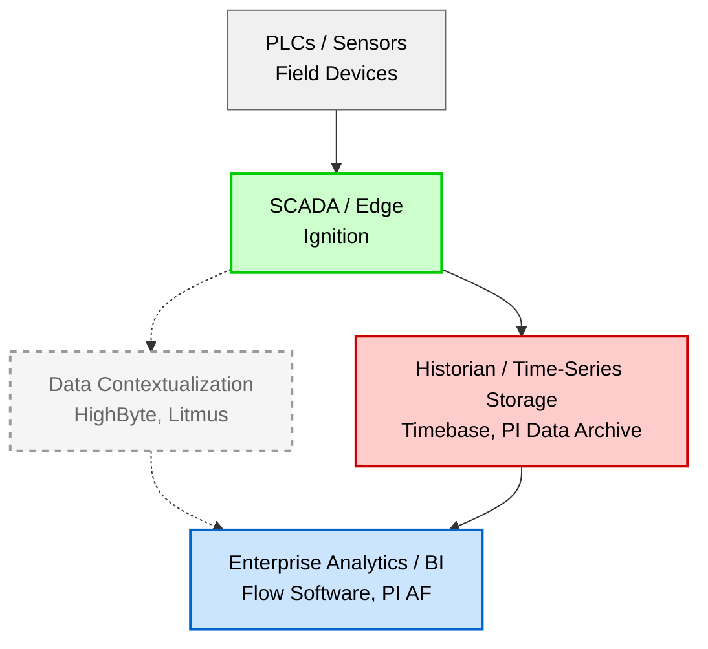
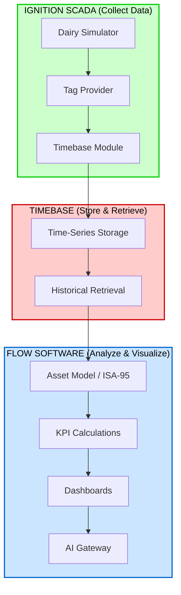

## Introduction

Raw tag data from a PLC is useless to a plant manager.

That statement might sound harsh, but it's true. A tag named `Compressor_01.Discharge_Pressure` with a value of `127.3` means nothing without context. What unit? Is that good or bad? How does it relate to the compressor's health? What about the other 500 tags in the system?

As a SCADA developer expanding into data architecture, I kept hearing the same platforms mentioned: PI Asset Framework, HighByte, Flow Software, Litmus. But I couldn't articulate *when* to use each one or *why* they exist in different layers of the stack.

So I'm building something. Using Ignition's Dairy Simulator as my data source, I'm implementing a complete data pipeline from edge collection through analytics using Timebase and Flow Software. This post documents my learning journey—starting with Flow's training and certification program, then moving to hands-on implementation.

## Background & Context

The industrial data challenge is simple to state but difficult to solve: **data is collected at the edge, but value is created higher up.**

PLCs and sensors generate millions of data points. SCADA systems display them. But turning that raw data into actionable insights—OEE calculations, predictive maintenance alerts, energy optimization—requires something more.

That "something more" is the modern industrial data stack:



*Solid lines: The stack I built (Ignition → Timebase → Flow)*
*Dashed lines: Optional contextualization layer (HighByte, Litmus)*

Each layer has a job. Understanding those jobs—and which tools belong where—is the key insight from this project.

> This post covers three platforms hands-on: Ignition (data collection), Timebase (historian with native Ignition integration), and Flow Software (analytics). I'll also discuss PI Asset Framework as the enterprise benchmark and HighByte as an optional contextualization layer.

---

## The Stack I Built

For this project, I kept the architecture simple:

```
Ignition (Dairy Simulator) → Timebase (Historian) → Flow (Analytics)
```

This mirrors the PI ecosystem structure (PI Interfaces → PI Data Archive → PI AF) but with modern, Ignition-native tools. No middleware, no message brokers, no contextualization layer—just a clean path from SCADA to analytics.

Why skip the contextualization layer? For many deployments, **Flow Software handles both contextualization AND analytics**. It builds asset hierarchies, creates templates, and adds ISA-95 structure. You don't always need a separate tool like HighByte—though there are cases where it makes sense (more on that later).

---

## PI Asset Framework: The Enterprise Benchmark

You can't understand the modern industrial data landscape without understanding PI Asset Framework. It's the dominant enterprise platform with 40+ years of OSIsoft heritage (now AVEVA).

### What PI AF Does

PI AF sits on top of the PI Data Archive (historian) and adds a context layer. Instead of just storing `Tag_123 = 127.3`, PI AF lets you say "This is the discharge pressure of Compressor 01, which is part of the Refrigeration system, which is in Building A."

**Core concepts:**

- **Asset Hierarchy:** Elements organized in parent-child relationships (Site → Area → Line → Equipment)
- **Templates:** Reusable asset definitions (like UDTs, but for assets)
- **Attributes:** Static data (nameplate info), dynamic data (linked to tags), and calculated data (formulas)
- **Event Frames:** Capturing process events, batches, and state changes

### Why PI AF Matters

Even if you never use PI AF directly, understanding it helps you:

1. **Communicate with clients** who have existing PI installations
2. **Position modern alternatives** like Flow Software
3. **Understand asset modeling concepts** that appear in every industrial data platform

### PI AF Limitations

PI AF's dominance comes with tradeoffs:

- **Licensing costs:** Per-user fees add up quickly
- **Deployment complexity:** On-premises infrastructure requirements
- **Separate visualization:** PI Vision is a separate product
- **Legacy architecture:** Not cloud-native or Docker-friendly

These limitations created the market opportunity for modern alternatives.

---

## Timebase: The Historian with Native Ignition Integration

Before data can be analyzed, it needs to be stored. That's where historians come in. Timebase is Flow Software's historian, and it has something that sets it apart: **native Ignition integration via a gateway module**.

### Where Timebase Fits

In the PI ecosystem, you have PI Data Archive (historian) + PI AF (context/analytics). In the Flow ecosystem, you have Timebase (historian) + Flow Information Hub (context/analytics).

```
Ignition Tags → Timebase Module → Timebase Historian → Flow Information Hub
```

The Timebase Module for Ignition acts as both a **Storage Provider** and **Tag History Provider**. This means Ignition treats Timebase like any other historian—you enable history on tags, and data flows automatically.

### Why Native Ignition Integration Matters

Most historians require additional configuration: OPC connections, data bridges, or custom scripting. The Timebase Ignition module eliminates this complexity.

**Key features:**

- **Automatic dataset creation:** When you enable history on a tag, Timebase creates the corresponding dataset automatically based on your Tag Provider structure
- **Multi-gateway support:** Prefix datasets to prevent naming conflicts when multiple Ignition gateways share the same Tag Provider names
- **Native retrieval:** Historical data is available directly in Perspective and Vision projects through standard Tag History bindings
- **Deadband and sampling respect:** Ignition's configured deadbands and sampling rules are applied before logging—you're not storing redundant data

### Hands-On: Dairy Simulator with Timebase

Setting up Timebase with the Dairy Simulator was straightforward:

**Step 1: Install the Module**

Downloaded the free Timebase Module from Flow Software and installed it through Ignition's Gateway interface. Gateway restart required.

**Step 2: Configure Connection**

Pointed the module at my Timebase instance (default port 4511 for HTTP, 4512 for HTTPS). For production, you'd configure authentication through Timebase Pulse with Client ID and Secret.

**Step 3: Enable Tag History**

On the Dairy Simulator tags I wanted to historize (compressor pressures, tank levels, motor currents), I simply changed the History Provider from the default to Timebase. That's it.

**Step 4: Verify Data Flow**

Within minutes, I could query historical data in Perspective using standard Tag History bindings. The datasets appeared automatically in Timebase, named after my Tag Provider structure.

### Key Takeaway

Timebase solves the historian problem for Ignition-centric environments. No OPC bridges, no custom scripting—just install the module and enable history on your tags. The data flows to Timebase and becomes available to Flow for analytics.

---

## Flow Software Information Hub: The Analytics Platform

Flow Software competes directly with PI Asset Framework. It's a full analytics platform: asset modeling, KPI calculations, dashboards, and enterprise integration.

### Flow vs. PI AF

| Capability | PI Asset Framework | Flow Software |
|------------|-------------------|---------------|
| Asset Hierarchy | ✓ | ✓ |
| Templates | ✓ | ✓ |
| KPI Calculations | ✓ | ✓ |
| Event Detection | ✓ (Event Frames) | ✓ (Events) |
| Visualization | Separate (PI Vision) | Built-in dashboards |
| User Licensing | Per-user fees | Unlimited users |
| Deployment | On-prem heavy | Cloud-native / Docker |
| AI Integration | Limited | AI Gateway |
| Native Ignition Historian | ✗ | ✓ (Timebase Module) |

The unlimited user licensing alone makes Flow attractive for organizations where PI Vision seat costs have become prohibitive. And the native Ignition integration through Timebase simplifies the entire data pipeline.

### The 5-Step Workflow

Flow organizes its functionality into five steps:

1. **Model:** Build asset hierarchy with templates and instances
2. **Connect:** Link to data sources (OPC UA, MQTT, Sparkplug B, Timebase)
3. **Transform:** Calculate KPIs, aggregations, and derived values
4. **Visualize:** Build dashboards with charts, gauges, and tables
5. **Bridge:** Output to external systems (cloud, databases, APIs)

### Hands-On: Dairy Simulator in Flow

With Timebase already collecting historical data from the Dairy Simulator, connecting Flow was straightforward.

**Asset Model:**

Created an ISA-95 hierarchy for the dairy plant:

```
Dairy_Plant (Enterprise)
└── Main_Facility (Site)
    ├── Refrigeration (Area)
    │   ├── Compressor_01
    │   ├── Compressor_02
    │   └── Chiller_Tank_01
    └── Processing (Area)
        ├── Pasteurizer_01
        └── Storage_Tank_01
```

Built templates for reusable equipment definitions:
- Compressor Template (discharge pressure, suction pressure, running status, current)
- Tank Template (level, temperature, pressure)
- Motor Template (running, speed, current draw)

**Data Connection:**

Connected Flow directly to Timebase. The historical data collected through the Ignition module was immediately available for analysis—no additional configuration needed.

**KPI Calculations:**

Defined calculated fields that update automatically:
- **Compressor Runtime Hours:** Accumulated running time
- **Tank Fill Percentage:** Current level / max capacity
- **Refrigeration Efficiency:** Output BTU / input kW

**Dashboard:**

Built an operational overview showing:
- Compressor status cards (running/stopped, current load)
- Tank level trends over 24 hours
- KPI summary with threshold indicators

The entire process—from raw Ignition tags to executive dashboard—took an afternoon. Compare that to a PI AF + PI Vision deployment.

---

## What About HighByte? (The Contextualization Layer)

You might be wondering why I didn't include HighByte in my hands-on stack. The answer: **Flow Software already handles contextualization**.

HighByte Intelligence Hub is a dedicated data contextualization platform. It sits between your SCADA system and analytics platforms, transforming raw tag data into clean, structured payloads. It's similar to Litmus and Crosser.

**HighByte's core concepts:**
- **Types:** Data model definitions (like UDTs for data payloads)
- **Instances:** Actual assets created from types
- **Flows:** Pipelines that transform and route data
- **ISA-95 Structure:** Hierarchical organization of assets

### When You Need HighByte (or Similar)

HighByte makes sense when:

- **Multiple downstream consumers:** You're feeding data to Flow AND cloud platforms AND a UNS broker simultaneously
- **Edge-heavy architecture:** You need contextualization at the edge before data leaves the site
- **Unified Namespace (UNS):** You're building a Sparkplug B architecture with structured MQTT topics
- **Non-Ignition sources:** You're aggregating data from multiple SCADA systems or protocols

### When Flow Is Enough

For many deployments, Flow handles both jobs:

- **Single analytics platform:** Flow is your only downstream consumer
- **Timebase as historian:** Data flows directly from Ignition → Timebase → Flow
- **Simpler architecture:** Fewer moving parts to maintain and troubleshoot

My Dairy Simulator project fell into the second category. Flow's built-in asset modeling, templates, and ISA-95 hierarchy covered everything I needed.

---

## Complete Integration Architecture

Here's the stack I built:



**Each layer has a distinct responsibility:**

| Layer | Tool | Responsibility |
|-------|------|----------------|
| Collection | Ignition | Read PLC data, expose tags |
| Storage | Timebase | Store time-series data via native module |
| Analytics | Flow | Model assets, calculate KPIs, visualize |

### Platform Comparison Summary

| Platform | Category | Similar To | When to Use |
|----------|----------|------------|-------------|
| Timebase | Historian | PI Data Archive, Canary | Native Ignition historian, feeding Flow |
| Flow Software | Analytics | PI Asset Framework | KPIs, dashboards, asset modeling |
| HighByte | Contextualization | Litmus, Crosser | Multi-consumer, UNS, edge transformation |

---

## Summary & Lessons Learned

This project clarified how industrial data platforms fit together. The key insight: **you don't always need every layer in the stack.**

**Three takeaways:**

1. **Timebase + Flow is a complete PI alternative.** The native Ignition module eliminates historian complexity. Flow handles contextualization AND analytics. For Ignition-centric deployments, this combination covers most use cases.

2. **Flow ≈ PI AF (enterprise analytics).** It's a full analytics platform competing with the industry incumbent. Unlimited user licensing, modern deployment options, and native Timebase integration are key differentiators.

3. **HighByte is optional, not required.** Dedicated contextualization tools like HighByte make sense for multi-consumer architectures and UNS deployments. But if Flow is your only analytics platform, it handles asset modeling natively.

Understanding PI Asset Framework—even without using it directly—provides context for positioning modern alternatives. When a client asks "How does this compare to PI?", you need an answer.

**Skills developed:**
- ISA-95 asset modeling (practical application)
- Historian integration with Ignition
- KPI definition and calculation
- Industrial analytics platform evaluation

For solution architects evaluating industrial data platforms, start simple. Ignition → Timebase → Flow covers most requirements. Add contextualization layers like HighByte when the architecture demands it.

---

## Resources & Links

**Platform Documentation:**
- [Flow Software Information Hub](https://flowsoftware.com/)
- [Timebase Module for Ignition](https://timebase.flow-software.com/en/knowledge-base/timebase-module-for-ignition)
- [HighByte Intelligence Hub](https://highbyte.com/)
- [AVEVA PI System](https://www.aveva.com/en/products/aveva-pi-system/)

**Training:**
- [Flow Software Training](https://www.flow-software.com/training) - Free online courses, Flow Core Certification, and Advanced Certification

**Standards:**
- [ISA-95 Overview](https://www.isa.org/standards-and-publications/isa-standards/isa-95-enterprise-control-system-integration)

**Data Source:**
- [Ignition by Inductive Automation](https://inductiveautomation.com/)

**Writing Framework:**
- [The Algorithmic Framework for Writing Good Technical Articles](https://www.theocharis.dev/blog/algorithmic-framework-for-writing-technical-articles/)